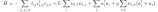
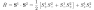

[](
https://travis-ci.org/krivenko/libcommute)
[](
https://krivenko.github.io/libcommute)

*libcommute* is a C++11/14/17 template library including two major parts.

* A Domain-Specific Language (DSL) designed to easily construct and manipulate
  polynomial expressions with quantum-mechanical operators,
  especially those used in the theory of many interacting fermions, bosons and
  spins.

* A fast intermediate representation of the quantum-mechanical operators
  that enables their action on finite-dimensional state vectors.
  This feature provides a basis for writing highly performant Exact
  Diagonalization (ED) codes without loss of flexibility.

Dependencies
------------

A C++11 conformant compiler. C++17 support is required for
the dynamic index sequence feature.

Installation
------------

*libcommute* is usable without installation, just add
`-I/<path_to_libcommute_sources>/include` to the compiler command line.

You will need CMake version 3.8.0 or newer [1] to build examples/unit tests and
to install *libcommute* so that it can be used from other CMake projects.

Assuming that *libcommute* is to be installed in `<LIBCOMMUTE_PREFIX>`,
the installation normally proceeds in a few simple steps.

```
$ git clone https://github.com/krivenko/libcommute.git libcommute.src
$ mkdir libcommute.build && cd libcommute.build
$ cmake ../libcommute.src                    \
  -DCMAKE_INSTALL_PREFIX=<LIBCOMMUTE_PREFIX> \
  -DEXAMPLES=ON                              \
  -DTESTS=ON
$ make
$ make test
$ make install
```

Compilation of the tests can be disabled with CMake flag `-DTESTS=OFF`
*(not recommended)*. Examples are compiled by default, disable them with
`-DEXAMPLES=OFF`.

Usage
-----

Once *libcommute* is installed, you can use it in your CMake project. Here is
a minimal example of an application `CMakeLists.txt` file.

```cmake
  cmake_minimum_required(VERSION 3.8.0 FATAL_ERROR)

  project(myproject LANGUAGES CXX)

  # Change the C++ standard to '17' if you plan to use
  # the dynamic index sequence feature
  set(CMAKE_CXX_STANDARD 11)

  # LIBCOMMUTE_ROOT is the installation prefix of libcommute
  set(LIBCOMMUTE_DIR ${LIBCOMMUTE_ROOT}/lib/cmake)

  # Import libcommute target
  find_package(libcommute 0.4 CONFIG REQUIRED)

  # Build an executable called 'myprog'
  add_executable(myprog myprog.cpp)
  target_link_libraries(myprog PRIVATE libcommute)
```

DSL for quantum-mechanical operators
------------------------------------

The following program constructs Hamiltonian of the Hubbard-Holstein model
on a square 10x10 lattice with nearest-neighbor hopping.



In addition, it

* prints the total number of terms (monomials) in the Hamiltonian;
* checks that it is Hermitian;
* checks that it commutes with the total number of electrons and
  with a projection of the total spin;
* prints all monomials of degree 3.

```c++
#include <cstdlib>
#include <iostream>

#include <libcommute/libcommute.hpp>

using namespace libcommute;

int main() {

  //
  // Parameters of the system
  //

  // Linear sizes of the lattice
  const int Nx = 10;
  const int Ny = 10;

  // Hopping constant
  const double t = 0.5;
  // Coulomb repulsion
  const double U = 2.0;
  // Electron-phonon coupling constant
  const double g = 0.1;

  // Expression with real coefficients 'H' will represent the Hamiltonian.
  // It is initially set to zero by its default-constructor.
  // Every creation and annihilation operator met in the expression must
  // carry two integer (coordinates of a lattice site) and one string
  // index.
  expression<double,               // type of expression's coefficients
             int, int, std::string // types of operator indices
             > H;

  // The following 'factory' functions make quantum operators with
  // statically typed indices and real coefficients.
  using static_indices::real::c_dag; // Create an electron
  using static_indices::real::c;     // Destroy an electron
  using static_indices::real::n;     // Number of electrons
  using static_indices::real::a_dag; // Create a phonon
  using static_indices::real::a;     // Destroy a phonon

  // Hopping terms of H
  for(auto spin : {"up", "down"}) {
    for(int ix = 0; ix < Nx; ++ix) {
      for(int iy = 0; iy < Ny; ++iy) {
        for(int jx = 0; jx < Nx; ++jx) {
          for(int jy = 0; jy < Ny; ++jy) {
            // Skip all pairs of lattice sites (ix,iy) and (jx,jy) that are
            // not nearest-neighbors.
            if((std::abs(ix - jx) % Nx == 1 && iy == jy) ||
               (ix == jx && std::abs(iy - jy) % Ny == 1)
            ) {
              // Add a hopping term
              H += -t * c_dag(ix, iy, spin) * c(jx, jy, spin);
            }
          }
        }
      }
    }
  }

  // Coulomb repulsion terms
  for(int ix = 0; ix < Nx; ++ix)
    for(int iy = 0; iy < Ny; ++iy) {
      H += U * n(ix, iy, "up") * n(ix, iy, "down");
    }

  // Energy of phonons
  for(int ix = 0; ix < Nx; ++ix)
    for(int iy = 0; iy < Ny; ++iy) {
      // The spin index is left blank for bosonic operators
      H += a_dag(ix, iy, "") * a(ix, iy, "");
    }

  // Electron-phonon coupling
  for(auto spin : {"up", "down"}) {
    for(int ix = 0; ix < Nx; ++ix) {
      for(int iy = 0; iy < Ny; ++iy) {
        H += g * n(ix, iy, spin) * (a_dag(ix, iy, "") + a(ix, iy, ""));
      }
    }
  }

  // Total number of terms (monomials) in 'H'.
  std::cout << "Total number of terms in H: " << H.size() << std::endl;
  // Is H Hermitian?
  std::cout << "H^\\dagger - H = " << (conj(H) - H) << std::endl;

  // Does H commute with N and S_z?
  decltype(H) N, S_z;
  for(int ix = 0; ix < Nx; ++ix) {
    for(int iy = 0; iy < Ny; ++iy) {
      N += n(ix, iy, "up") + n(ix, iy, "down");
      S_z += 0.5 * (n(ix, iy, "up") - n(ix, iy, "down"));
    }
  }
  std::cout << "[H, N] = " << (H * N - N * H) << std::endl;
  std::cout << "[H, S_z] = " << (H * S_z - S_z * H) << std::endl;

  // Iterate over all terms in 'H' and print those of degree 3.
  //
  // Monomials of degree 3 come from the electron-phonon coupling and
  // are products of two fermionic and one bosonic operators.
  for(auto const& term: H) {
    if(term.monomial.size() == 3) {
      // term.coeff is coefficient in front of the monomial
      std::cout << term.monomial << " => " << term.coeff << std::endl;
    }
  }

  return 0;
}
```

Code example: matrix representation of an operator
--------------------------------------------------

In this example we show how to construct a matrix representation of
the Heisenberg exchange interaction term between two spins 1/2.



Please note that computed matrix does not have to be stored in memory all at
once. *libcommute* needs storage only for two state vectors.

```c++
#include <algorithm>
#include <cstdlib>
#include <iostream>
#include <vector>

#include <libcommute/libcommute.hpp>

using namespace libcommute;

int main() {

  // The following 'factory' functions make spin operators with statically typed
  // indices and real coefficients.
  using static_indices::real::S_p;  // Spin-1/2 raising operator S_+
  using static_indices::real::S_m;  // Spin-1/2 lowering operator S_-
  using static_indices::real::S_z;  // Spin-1/2 operator S_z

  // Expression 'H' will represent the exchange interaction term.
  // Our spin operators will carry one integer index (site 1 or 2).
  auto H = 0.5 * (S_p(1) * S_m(2) + S_m(1) * S_p(2)) + S_z(1) * S_z(2);

  // Print 'H'
  std::cout << "H = " << H << std::endl;

  // Automatically analyze structure of 'H' and construct a 4-dimensional
  // Hilbert space (direct product of two spin-1/2 spaces).
  auto hs = make_hilbert_space(H);
  std::cout << "dim(hs) = " << hs.dim() << std::endl;

  // Construct a 'qoperator' object that represents action of expression 'H' on
  // state vectors in the Hilbert space 'hs'.
  auto Hop = make_qoperator(H, hs);

  // Here, we will act with 'Hop' on each of the 4 basis states |\psi> in 'hs',
  // |\phi> = Hop |\psi>, and print components of |\phi>. In other words,
  // we are going to construct the matrix representation <\phi|Hop|\psi>.

  // Preallocate state vectors.
  // Other containers, such as Eigen::Vector could be used instead.
  std::vector<double> phi(4), psi(4);
  // Iterate over basis states
  for(int i = 0; i < 4; ++i) {
    std::fill(phi.begin(), phi.end(), 0);
    std::fill(psi.begin(), psi.end(), 0);
    psi[i] = 1; // 'psi' is i-th basis vector now

    phi = Hop(psi);
    // NB.: It is generally recommended to use the in-place syntax
    //  Hop(psi, phi);
    // as it eliminates a memory allocation needed to store the result.

    std::cout << "H|" << i << "> = ";
    for(int j = 0; j < 4; ++j) {
      std::cout << "+(" << phi[j] << ")|" << j << ">";
    }
    std::cout << std::endl;
  }

  return 0;
}
```

It is easy to check that eigenvalues of the computed matrix are
{-3/4, 1/4, 1/4, 1/4}, which correspond to the spin singlet-triplet splitting.

Citing
------

If you find this library useful for your research, you can help me by citing it
using the following BibTeX entry.

```
TODO: Zenodo BibTeX entry here
```

License
-------

This Source Code Form is subject to the terms of the Mozilla Public
License, v. 2.0. If a copy of the MPL was not distributed with this
file, You can obtain one at http://mozilla.org/MPL/2.0/.

[1]: https://cmake.org/download
